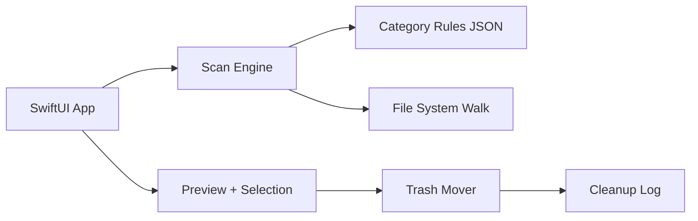

# MacSweeper — Simple Mac Disk Cleaner

A lightweight, native macOS app inspired by terminal tools like **ncdu** and **mac-cleanup-go**, with a calm UI that replaces expensive subscriptions like CleanMyMac.

> Working title: **MacSweeper** (see [Open Questions](#open-questions) for alternatives).

## Vision

Most people pay for CleanMyMac for the **UI and confidence**, not magic cleanup logic. MacSweeper focuses on three things:

1. **Scan** — find reclaimable space (caches, logs, old downloads)
2. **Preview** — show what will be removed, with sizes and risk level
3. **Clean safely** — move to Trash by default, never surprise-delete

No feature bloat. No scare tactics. No subscription.

## What We're NOT Building

- Malware scanning
- App updater
- Menu bar widgets / live monitoring
- "RAM cleaner" or fake optimization
- System `/private/var` deep cleaning
- Launch agents / login items management
- Orphaned app / leftover preference sweeping (v1)

## MVP Features

### Screens

| Screen | Purpose |
|--------|---------|
| **Home** | Disk free space + one primary "Scan" button |
| **Results** | Categories with checkboxes, sized and risk-labeled |
| **Detail** | Expand a category: paths, sizes, "why is this here?" |
| **Clean** | Summary → confirm → progress → "Freed X GB" + undo hint |

### Safe Defaults (v1)

Scanned and selected by default (risk: **Safe**):

- User `~/Library/Caches` (known regenerable app caches)
- Browser caches (Chrome, Safari, Firefox)
- Old logs in `~/Library/Logs`
- Xcode DerivedData (if present)

Off by default / opt-in:

- Old files in `~/Downloads` (risk: **Moderate** — user reviews before clean)
- Empty Trash (optional, **off by default**; needs Full Disk Access)

Deferred to [Phase 4 — Dev mode](#build-phases) (shipped as opt-in):

- `node_modules`, `.venv` / `venv` under common project roots
- Homebrew caches (Trash) + Manual `brew cleanup` guidance
- Manual Docker reclaim guidance (`docker system prune`)

### Never Touch (v1 exclusions)

Hard exclusions — never listed as cleanable, even if large:

- `~/Documents`, `~/Desktop`, `~/Pictures`, `~/Music`, `~/Movies`
- iCloud Drive / Photos libraries
- Keychains, passwords, browser profiles (except regenerable cache dirs)
- SIP-protected system paths
- Anything outside the user home folder (v1)

## Safety Rules

These are the core differentiators. Borrowed from [mac-cleanup-go](https://github.com/2ykwang/mac-cleanup-go) and [Mole](https://github.com/tw93/Mole).

| Rule | Description |
|------|-------------|
| **Trash first** | Never permanent delete except explicit "Empty Trash" |
| **Preview always** | Dry-run before any deletion; user must confirm |
| **Risk labels** | Safe / Moderate / Risky / Manual — Risky unchecked by default |
| **SIP-aware** | Don't touch protected system paths |
| **Minimal permissions** | Request Full Disk Access only when needed, explain why |
| **Audit everything** | Log what moved where, for the session (and optionally to disk) |

### Risk Levels

| Level | Meaning | Default selection |
|-------|---------|-------------------|
| **Safe** | Auto-regenerated caches/logs | Checked |
| **Moderate** | May require re-download or re-login | Unchecked |
| **Risky** | Possible user data | Unchecked; visually de-emphasized |
| **Manual** | Guide only — no automatic deletion | N/A (no checkbox) |

### Undo & Audit

- **Undo:** After a clean, show "Open Trash" (and optionally restore via Finder). Session-level undo = reverse the Trash moves for items still in Trash. No permanent-delete undo.
- **Audit log:** Record timestamp, category id, paths, bytes, and destination for each move. Keep the latest session in-app; optionally write to `~/Library/Application Support/MacSweeper/cleanup.log`.

## Tech Stack

### Decision: Swift + SwiftUI (native scan engine)

Phase 1 ships a **native** scan engine with declarative JSON rules — no CLI dependency.

```
Swift + SwiftUI
├── Scan engine (background FileManager walk)
├── File operations (FileManager → Trash)
└── 4-screen UI (Home → Results → Detail → Clean)
```

**Why:**

- Native Mac feel; list + checkbox UI is a natural fit
- No external binary to bundle, update, or license-check
- Straightforward path to notarized `.app` or Mac App Store

### Alternatives considered

| Approach | Pros | Cons | Status |
|----------|------|------|--------|
| **Swift + SwiftUI** | Native, lightweight, App Store ready | macOS only | **Chosen** |
| **Tauri + Rust** | Cross-platform, small binary | Less native feel | Not for v1 |
| **Electron** | Fast to prototype | Heavy, battery drain | Rejected |
| **Wrap existing CLI** | Proven scan logic | Dependency, licensing, UX friction | Revisit later if rule coverage stalls |

### Inspiration for rules (not bundled in v1)

Reference these for category ideas; Phase 1 reimplements a small subset in Swift + JSON:

- [mac-cleanup-go](https://github.com/2ykwang/mac-cleanup-go) — preview-first, safety levels, 100+ targets
- [Mole](https://github.com/tw93/Mole) — broader clean / uninstall / analyze
- [disky](https://github.com/biliboss/disky) — APFS-aware scanning, Trash-restorable cleanup

## UI Wireframes

### Home

```
┌─────────────────────────────────────┐
│  MacSweeper                      ⚙  │
├─────────────────────────────────────┤
│                                     │
│         42.3 GB free                │
│     ████████░░░░░░░░  68% used      │
│                                     │
│         [  Scan My Mac  ]           │
│                                     │
│  Last clean: freed 2.1 GB           │
└─────────────────────────────────────┘
```

### Results

```
┌─────────────────────────────────────┐
│  Found 4.8 GB to reclaim            │
├─────────────────────────────────────┤
│  ☑ Browser caches      1.2 GB Safe  │
│  ☑ App caches          890 MB Safe  │
│  ☐ Old downloads       2.1 GB Moderate │
│  ☑ Xcode DerivedData   620 MB Safe  │
├─────────────────────────────────────┤
│  Selected: 2.7 GB    [ Clean Now ]  │
└─────────────────────────────────────┘
```

### Detail (expand a category)

```
┌─────────────────────────────────────┐
│  ← Browser caches          1.2 GB   │
├─────────────────────────────────────┤
│  Why: Temporary files. Chrome and   │
│  Safari rebuild these automatically.│
│                                     │
│  ~/Library/Caches/Google/Chrome     │
│    Cache_Data/           980 MB     │
│  ~/Library/Caches/com.apple.Safari  │
│    WebKit/               220 MB     │
└─────────────────────────────────────┘
```

### Clean

```
┌─────────────────────────────────────┐
│  Ready to clean 2.7 GB              │
├─────────────────────────────────────┤
│  • Browser caches        1.2 GB     │
│  • App caches            890 MB     │
│  • Xcode DerivedData     620 MB     │
│                                     │
│  Items move to Trash. You can       │
│  restore them from Trash anytime.   │
│                                     │
│     [ Cancel ]    [ Move to Trash ] │
└─────────────────────────────────────┘
         ↓ (progress) ↓
┌─────────────────────────────────────┐
│  Freed 2.7 GB                       │
│  12 items moved to Trash            │
│                                     │
│     [ Open Trash ]    [ Done ]      │
└─────────────────────────────────────┘
```

### Design Principles

- One primary action per screen
- No dashboards, no upsells, no scare tactics
- Show **paths** on expand (builds trust)
- System fonts and native controls — "simple" means familiar
- Scan and clean run off the main thread; user can cancel a scan

## Architecture



### Scan Engine: Declarative Rules

Rules live in JSON, not hardcoded Swift:

```json
{
  "id": "browser_chrome_cache",
  "label": "Chrome cache",
  "paths": ["~/Library/Caches/Google/Chrome"],
  "risk": "safe",
  "description": "Temporary files; Chrome rebuilds these automatically."
}
```

Start with ~15–20 high-value, low-risk rules. Expand over time.

**Size reporting (v1):** Use allocated size via `FileManager` / `URLResourceValues` (naive walk). APFS clone / sparse / hard-link accuracy is a later improvement; label sizes as approximate if needed.

**Concurrency:** Scan on a background queue; stream category results to the UI; support cancel.

### Project Structure (proposed)

```
MacSweeper/
├── MacSweeper/
│   ├── App/
│   │   └── MacSweeperApp.swift
│   ├── Views/
│   │   ├── HomeView.swift
│   │   ├── ScanResultsView.swift
│   │   ├── CategoryDetailView.swift
│   │   └── CleanFlowView.swift
│   ├── Models/
│   │   ├── ScanCategory.swift
│   │   ├── ScanResult.swift
│   │   └── RiskLevel.swift
│   ├── Services/
│   │   ├── ScanEngine.swift
│   │   ├── CleanupService.swift
│   │   ├── AuditLogService.swift
│   │   └── DiskSpaceService.swift
│   └── Resources/
│       └── cleanup-rules.json
├── MacSweeperTests/
└── README.md
```

## Permissions

| Permission | When needed | Why |
|------------|-------------|-----|
| None | Scan `~/Library`, `~/Downloads` | Works out of the box for most Safe rules |
| Full Disk Access | Empty Trash; some protected cache paths | macOS privacy gate — request only when user opts in |
| Admin (sudo) | System caches | **Avoid in v1** |

In-app copy: *"We need this to empty Trash. Files never leave your Mac."*

**Distribution note:** Sandboxed Mac App Store builds may need security-scoped bookmarks for some paths; notarized direct download can request Full Disk Access more simply. Choose distribution before locking permission UX.

## Build Phases

| Phase | Scope | Timeline |
|-------|-------|----------|
| **1** | Scan home caches via JSON rules; sizes + checkbox list; Detail expand | Weekend |
| **2** | Move selected items to Trash; confirm flow; undo hint + session audit log | +1 week |
| **3** | Polish: cancelable scan, better size accuracy, optional FDA empty-Trash | +1 week |
| **4** | Dev mode (`node_modules`, Docker, Homebrew) — opt-in section | +2 weeks |

**Phase 4 decisions:**

- Off by default (Home toggle: “Include Dev mode”).
- Discovery roots only: `~/Developer`, `~/Projects`, `~/src`, `~/code`, `~/Documents/GitHub`, `~/Desktop` (depth ≤ 6; no nested `node_modules`).
- `node_modules` / virtualenvs: Risky, Trash, unchecked.
- Homebrew caches: Moderate, Trash.
- Docker reclaim and Homebrew deep cleanup: Manual rows with copyable commands — no shell-out.
- No full-home walk, user-picked folders, or sudo/system paths.
| **Later** | ncdu-style disk treemap (optional, not on the critical path) | TBD |

### Phase 1 non-goals

- No Trash moves yet (scan + preview only)
- No Full Disk Access prompt
- No system paths, no treemap, no Dev mode
- No CLI wrapping

## Competitive Comparison

| | CleanMyMac | MacSweeper |
|---|------------|------------|
| Price | ~$40/year | Free (tip jar later) |
| Features | Everything + kitchen sink | 3 clear actions |
| Transparency | Black-box cleaning | Shows every path |
| Marketing | Aggressive upsells | Calm, honest UI |
| "Optimization" | Theater | Only real disk reclaim |
| Platform | macOS | macOS |

## Inspiration & References

| Tool | What to borrow |
|------|----------------|
| [ncdu](https://dev.yorhel.nl/ncdu) | Fast directory scanning, size-sorted navigation |
| [mac-cleanup-go](https://github.com/2ykwang/mac-cleanup-go) | Safety levels, preview-first, category coverage |
| [Mole](https://github.com/tw93/Mole) | Broad cleanup categories, orphaned-app ideas (post-v1) |
| [disky](https://github.com/biliboss/disky) | APFS-aware scanning, Trash-restorable cleanup patterns |

## Open Questions

- [ ] App name finalization (MacSweeper, TidyMac, Sweep, ClearDesk?)
- [ ] Distribution: notarized direct download vs Mac App Store?
- [ ] Monetization timing: free forever vs tip jar after Phase 2?
- [ ] Code signing / notarization setup for distribution
- [ ] Persist audit log across launches, or session-only?

## License

MIT — see [LICENSE](LICENSE). Revisit if we later vendor or wrap a third-party scanner (license must stay compatible).
